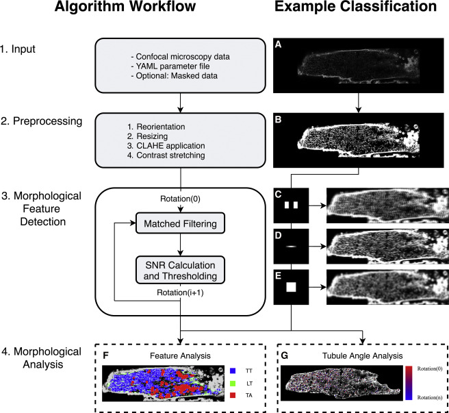
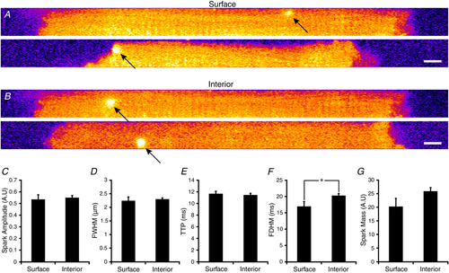

# Projects
{:.no_toc}

* TOC
{:toc}

## Overview

Welcome to the projects section of my portfolio! Browsing around here, you can see some of the things that I've worked on over the years.

This page has turned into somewhat of a developer story and describes the journey I've taken from a chemical engineering student with a cursory interest in software development to a competent software developer (at least I would like to think so!).

If you would like to just browse my projects without the story, look to the menu bar to the left or the links at the bottom of the page.

## Career Projects

These projects are ones that I've worked on during my career as a researcher.

### The Kekenes-Huskey Lab

During my junior year at the University of Kentucky, I took Physical Chemistry for Engineers with Dr. Kekenes-Huskey. Dr. Huskey mentioned that his research was "entirely theoretical and based on computer modeling" which piqued my interest. I had a quick chat with him and within the week was working towards joining the lab.

#### MatchedMyo

I started out working in the Kekenes-Huskey Lab at the University of Kentucky Department of Chemistry on some reaction-diffusion models of calcium in the heart but quickly moved on to my personal project, detecting remodeling in heart cells due to heart failure. This culminated in the [MatchedMyo project](matchedmyo/matchedmyo.md) that was published in the [Biophysical Journal](https://doi.org/10.1016/j.bpj.2019.03.010).

#### Calcium Spark Detection

While working on the MatchedMyo project, the lab was approached with a need for development of an algorithm that detected calcium release events in heart muscle. I designed, developed, and tested the [calcium spark detection algorithm](ca_spark/ca_spark.md) that was published in the [Journal of Physiology](https://doi.org/10.1113/JP277360).

### The Campbell Muscle Lab

The Kekenes-Huskey lab moved to Loyola University in Chicago and I had personal ties to Lexington, Kentucky, so I decided to stay when offered a job with Ken Campbell at the Campbell Muscle Lab.

#### PyOpt

[Numerical modeling framework.](pyopt/pyopt.md)

#### FiberSim Blender Visualization

[FiberSim Blender visualization pipeline.](fibersim_blender_visualization/fibersim_blender_visualization.md)

## Hobby Projects

These projects are all ones that I developed in my own time, either for fun, to scratch an intellectual itch, or to make my life easier in some way!

### Ingreedyents

The idea for Ingreedyents hit me when I was walking through the aisles one day at Kroger. I thought wouldn't it be great if we could combine a UPC scanner with recipe nutrient tracking (macro- and micro-nutrients) and potentially recipe-to-availabe-ingredient matching? I played around with this for some time and have since developed [Ingreedyents](ingreedyents/ingreedyents.md). 

### uniTypes

When working on [Ingreedyents](#ingreedyents), I needed a way to conveniently handle units and conversions between units of food, macronutrients, and micronutrients that I was handling for the nutrition information of the recipes. Out of this necessity, [uniTypes](http://github.com/dcolli23/uniTypes) was born.

uniTypes is a header only implementation of a unit library based initially on [this writeup](https://benjaminjurke.com/content/articles/2015/compile-time-numerical-unit-dimension-checking/) but eventually growing into its own library, owing mostly to the need for a string-to-unit type map. uniTypes is convenient to use thanks to the use of user-defined literals for type specification.

